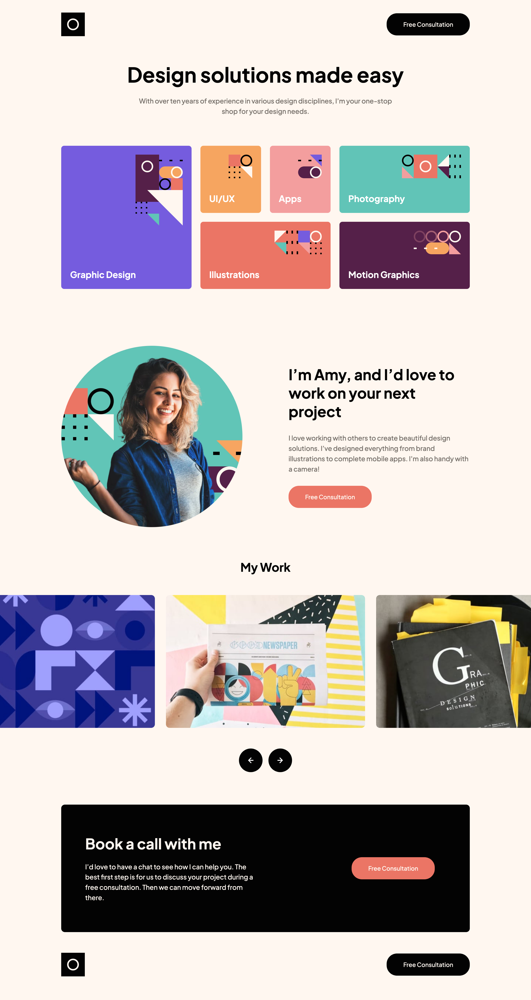

# Frontend Mentor - Single-page design portfolio solution

This is a solution to the [Single-page design portfolio challenge on Frontend Mentor](https://www.frontendmentor.io/challenges/singlepage-design-portfolio-2MMhyhfKVo).

## Table of contents

- [Frontend Mentor - Single-page design portfolio solution](#frontend-mentor---single-page-design-portfolio-solution)
  - [Table of contents](#table-of-contents)
  - [Overview](#overview)
    - [The challenge](#the-challenge)
    - [Screenshot](#screenshot)
    - [Links](#links)
  - [My process](#my-process)
    - [Built with](#built-with)
    - [What I learned](#what-i-learned)
    - [Useful resources](#useful-resources)
  - [Author](#author)

**Note: Delete this note and update the table of contents based on what sections you keep.**

## Overview

### The challenge

Users should be able to:

- View the optimal layout for the site depending on their device's screen size
- See hover states for all interactive elements on the page
- Navigate the slider using either their mouse/trackpad or keyboard

### Screenshot

### Links

- Code: [Github](https://your-solution-url.com)
- Site: [Github pages](https://your-live-site-url.com)

## My process

### Built with

- Semantic HTML5 markup
- Sass
- Flexbox
- CSS Grid
- Vanilla Js
- Custom slideshow

### What I learned

The biggest challenge was the creation of the custom slideshow/carousel without using a library.

### Useful resources

- [Glidejs](https://github.com/glidejs/glide) - This cleared out some things about implementing a carousel.

## Author

- Github - [Menelaos Kokaras](https://github.com/mkokaras)
- Frontend Mentor - [@mkokaras](https://www.frontendmentor.io/profile/mkokaras)
- Linkedin - [@menelaos-kokaras](www.linkedin.com/in/menelaos-kokaras-9a6618235)
